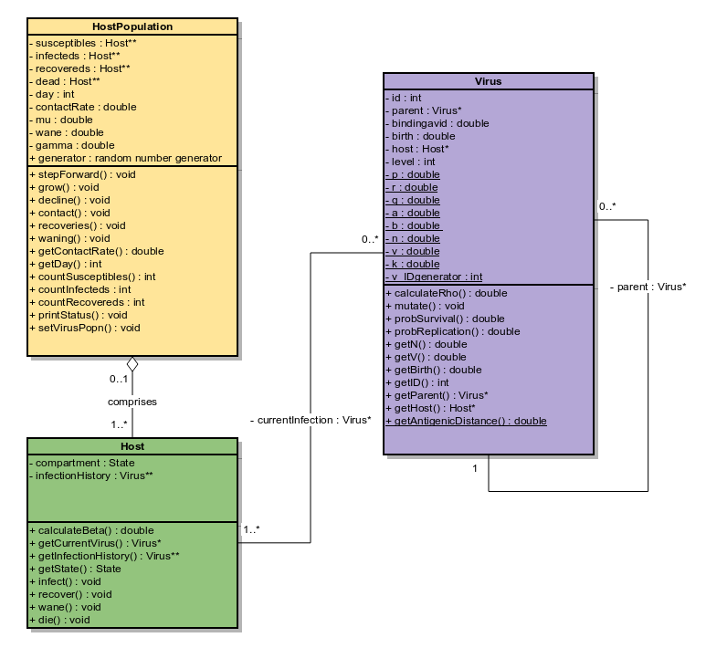

```{r setup, include=FALSE}
library(driftSim)
knitr::opts_chunk$set(echo = TRUE, fig.width=7,fig.height=6,
                      message=FALSE, results=FALSE,warning=FALSE)
```

## Placeholder
This documentation is currently incomplete. All current users of the package should be able to use the package from the other vignettes and documentation. Specific use cases will be added as an when they are requested. Below are just some specific tips for issues/queries that users might run into.

##1. Basic usage
It is easy to get the simulation running using the set of example parameters provided with the package.
```r
library(driftSim)

## Example parameter values attached to the package:
## 1. flags (flags for simulation output saving)
## 2. hostpars - vector of parameters related to host population. See ?exampleParameters
## 3. viruspars - vector of parameters related to virus population. See ?exampleParameters
## 4. deltaVMat - matrix of gradients describing how binding avidity changes within a 
##    particular host in a single day. See ?calculate_deltaV_matrix
attach(exampleParameters)

sim_duration <- 365 ## Duration of simulation in days
version <- 1
scenario_descriptions(1) ## Which version of the simulation to run (1-4)
output <- run_simulation(flags=flags, hostpars=hostpars, viruspars=viruspars, deltaVMat=deltaVMat,
                         iniKs=NULL,start=0,end=365,input_files="",output_files=c("SIR.csv","","","","",""),
                         VERBOSE=TRUE,scenario=version)
sir <- read.table("SIR.csv",header=FALSE,sep=",")
plot_SIR(sir)
```

## 2. Model scenarios
There are 4 different scenarios that can be run, specified by the `scenario` argument. By specifying the scenario from 1-4, the user can turn on or off particular mechanisms relating to binding avidity adaptation and antigenic drift. Descriptions can be found using the `scenario_descriptions` function:

1. **Random anigenic drift only. Binding avidity fixed**. This is the "base" form of the model. Binding avidity is fixed at whatever value was set in the `hostpars` argument, specifically `hostpars["iniBind"]`. Note that this is the version to use with fixed antigenic distance by setting `viruspars["probMut"] <- 0`
2. **No drift; adaptive binding avidity; adaptive antigenic change. Binding avidity adaptation and antigenic change proportional to binding avidity change**. This version of the model allows binding avidity of a particular virus to adapt to the host's immune state. Antigenic distance does not change from random drift, but there is antigenic change proportional to the amount of binding avidity adaptation (`viruspars["VtoD"]`). The parameter `viruspars["kc"]` specifies how quickly binding avidity adapts, and the matrix produced by `calculate_deltaV_matrix` generates the amount of change different values of binding avidity and host immunity. See the bottom of the following [vignette](https://jameshay218.github.io/driftSim/inst/doc/transmission_model.html) for more detail
3. **Random drift, binding avidity adaptation and antigenic change from binding avidity change**. As above but antigenic drift occurs as in scenario 1 in addition to antigenic change as a byproduct of binding avidity adaptation. Make sure `viruspars["probMut"]` is above 0
4. **Random drift and binding avidity adaptation (no binding avidity related antigenic change)**. As above, but antigenic distance does **not** change with binding avidity adaptation, regardless of the the value for `viruspars["VtoD"]`

## 3. Input flags
The input flags can be confusing - it might not be quite clear what they each do. Descriptions of these are below, along with use cases for the host input flags. Please refer to `?exampleParameters` to get an idea of what these flags look like.

1. **SIR_flag**: If set to TRUE, then the SIR dynamics (ie. number of S, I and R at each time step) are saved to the file specified by `output_files[1]`. If using this, ensure that you have specified the output file location to avoid unexpected results.
2. **voutput_phylogenetic_flag**: If set to TRUE, then properties of all of the simulation generated viruses are saved as a table. Refer to the summary of [model output files](https://jameshay218.github.io/driftSim/inst/doc/outputs.html). Again, make sure that the file location as specified by `output_files[2]` is correct
3. **voutput_pairwise_flag**: If set to TRUE, saves a random sample of 1000 viruses to a matrix giving the antigenic distance between every pair of viruses. The output location for this is set with `output_files[3]`. Refer to the summary of [model output files](https://jameshay218.github.io/driftSim/inst/doc/outputs.html) for more detail
4. **time_flag**: If set to TRUE, records the actual run time of the simulation and prints this to the console upon completion.
5. **save_state**: If set to TRUE, saves key properties of the *host* population to the file specified by `output_files[4]`. Refer to the summary of [model output files](https://jameshay218.github.io/driftSim/inst/doc/outputs.html) for more detail
6. **input_flag_generated**: If set to TRUE, generates a distribution of $j$ values (referred to as $k$ in the code) that is then used to generate a starting host population with some level of immunity. You must specify a **vector of j values** using the `iniKs` argument. This flag ultimately calls `generateHotsKDist_2`, which is shown below:
```{r, eval=FALSE}
## Generate a uniform distribution of 1000 j values (referred to as $k$ in the code) from 0 to 9
iniKs <- floor(runif(1000,0, 10))

## How many individuals do we want in the new simulation?
N <- 10000

## From the same distribution of iniKs, draw N j values (referred to as $k$ in the code)
startingKs <- generateHostKDist_2(iniKs,N)
```

It is important to note that the function (and `iniKs` in `run_simulation`) expects a vector of *values*, **not frequencies**. The frequency distribution will be generated within the function. It's unlikely that the user will be specifing `iniKs` manually - the intention is to use the `hostK` column of the `hosts.csv` output of a previous run, as described in the section 5 of the [model output files](https://jameshay218.github.io/driftSim/inst/doc/outputs.html). For example, using the "basic usage" example above:
```{r,eval=FALSE}
hostK_file <- read.csv("hosts.csv")
iniKs <- hostK_file$hostK
flags["input_flag_generated"] <- TRUE
output <- run_simulation(flags=flags, 
                         hostpars=hostpars, viruspars=viruspars, deltaVMat=deltaVMat,
                         iniKs=iniKs,
                         start=0,end=365,input_files="",output_files=c("SIR.csv","","","","",""),
                         VERBOSE=TRUE,scenario=version)
```
7. **input_flag_generated**: If set to TRUE, generates a distribution of $j$ values (referred to as $k$ in the code) similar to the description above, but uses the specified `input_files[1]` argument to read in a file. This essentially does the same job, but bypasses the need for the user the read in the host file and extract the $j$ values (referred to as $k$ in the code). This flag asks the simulation to run the function `generateHostKDist`.
8. **save_k**: If set to TRUE, saves the *frequency distribution* of $j$ values (referred to as $k$ in the code) at regular points in the simulation to the file location specified by `output_files[5]`. The frequency at which this distribution is saved is given by `hostpars["saveFreq"]`. Refer to the summary of [model output files](https://jameshay218.github.io/driftSim/inst/doc/outputs.html)


## 4. UML diagram
